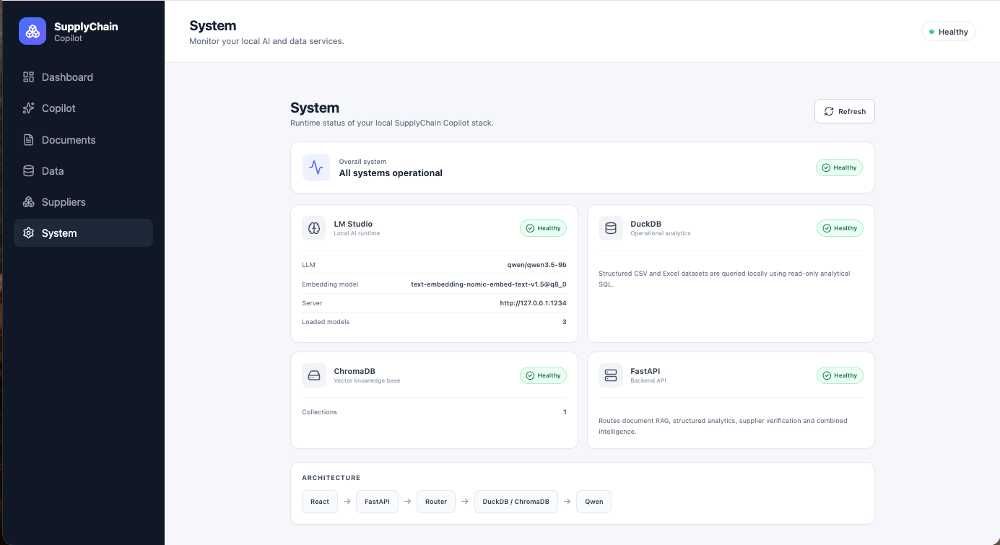
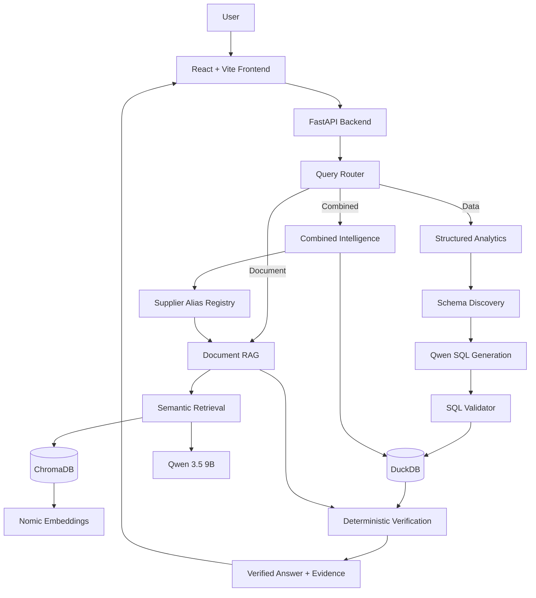
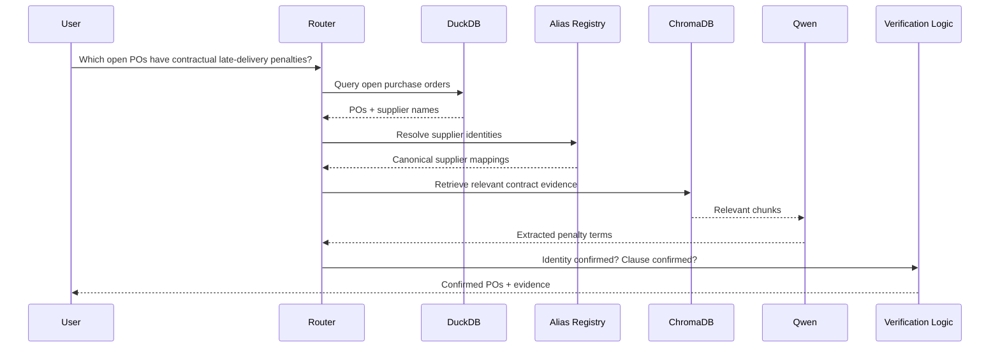

<div align="center">

# SupplyChain Copilot

### Local AI for supply-chain decisions — grounded in operational data and contract evidence

**Ask one question. Query structured data. Retrieve supplier clauses. Verify identities. Return evidence-backed answers.**


[Preview](#-application-preview) ·
[Why it matters](#-why-this-project-is-different) ·
[Architecture](#-system-architecture) ·
[Try it](#-questions-you-can-ask) ·
[Quick start](#-quick-start) ·
[Roadmap](#-roadmap)

</div>

> **Project Status — v1.0**
>
> SupplyChain Copilot is currently a local-first working prototype and portfolio project. It is not yet production-ready.
>
> Contract and supplier analysis is intended for operational decision support only and should not be treated as legal advice.

---

## ⚡ What is SupplyChain Copilot?

SupplyChain Copilot is a **local-first AI operations assistant** built for realistic supply-chain and procurement workflows.

It combines two worlds that are usually separated:

| Operational data | Business documents |
|---|---|
| Purchase orders | Supplier agreements |
| Shipments | Contracts |
| Inventory | Commercial terms |
| Supplier master data | Penalty clauses |
| Excel / CSV | Policies / SLAs |

Instead of returning a generic LLM answer, the system can:

1. query live operational tables,
2. identify the suppliers involved,
3. resolve supplier name differences,
4. retrieve supporting contract clauses,
5. verify supplier coverage,
6. apply deterministic business rules,
7. return only confirmed results with evidence.

> **Example**
>
> **“Which open purchase orders belong to suppliers with contractual late-delivery penalties?”**

That single question requires **SQL analytics + RAG + supplier entity resolution + deterministic verification**.

---

## 📸 Application Preview

### Operations Dashboard

Real-time operational KPIs across shipments, purchase orders, inventory, documents, datasets, and supplier mappings.


<details>
<summary><strong>What the dashboard tracks</strong></summary>

- Delayed shipments
- Open purchase orders
- Low-stock items
- Outstanding PO value
- Indexed documents
- Indexed pages / chunks
- Structured datasets
- Supplier aliases
- Recent uploads

Dashboard KPI cards can launch related Copilot questions directly.

</details>

---

### AI Operations Copilot

Ask natural-language questions across structured data and supplier documents.


<details>
<summary><strong>What appears in a Copilot answer</strong></summary>

Depending on the route, the response can include:

- natural-language answer
- structured result table
- generated SQL
- document source pages
- confirmed supplier evidence
- unconfirmed suppliers
- router decision
- combined-analysis details
- deterministic qualification result

</details>

---

### Local AI System Health

Monitor the complete local runtime stack.



<details>
<summary><strong>Runtime components</strong></summary>

- LM Studio
- Qwen 3.5 9B
- Nomic embeddings
- DuckDB
- ChromaDB
- FastAPI

</details>

---

## 🎯 Why this project is different

Many AI demos stop at:

```text
User → LLM → Answer
```

SupplyChain Copilot intentionally does more:

```text
User
 ↓
Intent Routing
 ↓
Operational Data + Document Evidence
 ↓
Supplier Identity Verification
 ↓
Deterministic Business Rules
 ↓
Verified Answer
```

### The key design principle

> **The LLM can extract and explain evidence.  
> Application logic decides whether a supplier or PO actually qualifies.**

That distinction matters for real operational use.

---

## 🧠 Three intelligence modes

| Route | When it is used | Example |
|---|---|---|
| **Data** | Structured data only | “Which shipments are delayed?” |
| **Document** | Contract / PDF evidence only | “What is the late-delivery penalty?” |
| **Combined** | Operational data + document evidence | “Which open POs belong to suppliers with penalties?” |

A fourth route, **Unsupported**, is used when the workspace cannot answer the question reliably.

---

## 🏗 System Architecture



---

## 🔍 How combined intelligence works



---

## 🧾 Supplier identity verification

Operational systems and contracts often use different supplier names.

```text
Operational data
Atlas Industrial

Contract
Atlas Industrial Supplies Ltd.
```

SupplyChain Copilot uses an explicit alias registry:

```text
Atlas Industrial
        ↓
Atlas Industrial Supplies Ltd.
```

### Why this matters

Fuzzy matching alone can be risky:

```text
Atlas Industrial
Atlas Industries
Atlas Industrial Supplies Ltd.
```

These could represent:

- the same company,
- different legal entities,
- related companies,
- or completely unrelated suppliers.

So supplier identity is **explicitly controlled**, not silently inferred by the LLM.

---

## ✅ Deterministic contract qualification

For a supplier to qualify:

```text
Supplier identity confirmed
        +
Relevant contractual clause confirmed
        =
Confirmed supplier
```

Conceptually:

```python
confirmed = (
    supplier_coverage_confirmed
    and penalty_clause_confirmed
)
```

The LLM helps with retrieval and extraction.

The final qualification is made by application logic.

---

## 🗂 Structured Data Analytics

Upload:

- CSV
- XLSX
- multi-sheet Excel workbooks

Each worksheet becomes a DuckDB table.

Example:

```text
Synthetic_SupplyChain_Operations.xlsx
├── Inventory
├── Shipments
└── Purchase Orders
```

becomes:

```text
synthetic_supplychain_operations_inventory
synthetic_supplychain_operations_shipments
synthetic_supplychain_operations_purchase_orders
```

### Natural language → SQL flow

```text
Question
 ↓
Schema Discovery
 ↓
Qwen SQL Generation
 ↓
SQL Validation
 ↓
DuckDB Execution
 ↓
Structured Result
```

---

## 📄 Document RAG

Supplier contracts are processed through a page-aware retrieval pipeline:

```text
PDF
 ↓
PyMuPDF
 ↓
Text Extraction
 ↓
Chunking
 ↓
Nomic Embeddings
 ↓
ChromaDB
 ↓
Semantic Retrieval
 ↓
Qwen
 ↓
Answer + Source Pages
```

The system can return document and page references with answers.

---

## 💬 Questions you can ask

<details open>
<summary><strong>Structured analytics</strong></summary>

```text
Which shipments are delayed?

Which purchase orders are open?

Which inventory items are below reorder level?

What is the total outstanding purchase order value?
```

</details>

<details>
<summary><strong>Contract questions</strong></summary>

```text
What are the supplier payment terms?

What is the standard delivery lead time?

What is the late-delivery penalty?

What is the maximum penalty cap?
```

</details>

<details>
<summary><strong>Combined intelligence</strong></summary>

```text
Which open purchase orders belong to suppliers with contractual late-delivery penalties?
```

This query exercises the full stack:

```text
Operational data
+ Supplier resolution
+ Document retrieval
+ Clause extraction
+ Deterministic verification
```

</details>

---

## 🧩 Core Modules

<details>
<summary><strong>Dashboard</strong></summary>

Provides deterministic KPIs for:

- delayed shipments
- open POs
- low stock
- outstanding value
- documents
- datasets
- supplier aliases

</details>

<details>
<summary><strong>Copilot</strong></summary>

Displays:

- answers
- structured tables
- contract evidence
- confirmed / unconfirmed suppliers
- generated SQL
- router details
- source pages

</details>

<details>
<summary><strong>Documents</strong></summary>

Supports:

- PDF upload
- text extraction
- chunking
- vector indexing
- document inventory
- page/chunk counts
- deletion
- replacement on re-upload

</details>

<details>
<summary><strong>Data</strong></summary>

Supports:

- CSV upload
- XLSX upload
- multi-sheet ingestion
- automatic DuckDB tables
- row counts
- column discovery
- preview

</details>

<details>
<summary><strong>Suppliers</strong></summary>

Manages explicit supplier alias mappings used during combined analysis.

</details>

<details>
<summary><strong>System</strong></summary>

Shows runtime health for:

- LM Studio
- Qwen
- Nomic
- DuckDB
- ChromaDB
- FastAPI

</details>

---

## 🛠 Technology Stack

| Layer | Technology |
|---|---|
| Frontend | React + Vite |
| API | FastAPI |
| Language | Python 3.11 + JavaScript |
| Local LLM Runtime | LM Studio |
| LLM | Qwen 3.5 9B |
| Embeddings | Nomic Embed Text |
| Vector Store | ChromaDB |
| Structured Analytics | DuckDB |
| Data Processing | Pandas |
| Excel | OpenPyXL |
| SQL Parsing / Validation | SQLGlot |
| PDF Processing | PyMuPDF |
| UI Icons | Lucide React |

---


## 💻 Languages Used

| Language / Syntax | Where it is used |
|---|---|
| **Python 3.11** | FastAPI backend, RAG pipeline, embeddings, analytics services, routing, supplier verification, health checks |
| **JavaScript / JSX** | React frontend, page components, API calls, Copilot UI, dashboard interactions |
| **SQL** | DuckDB analytics queries generated and validated by the backend |
| **CSS** | Application layout, dashboard styling, responsive UI, evidence cards, system-health views |
| **HTML** | Vite application shell and browser entry point |
| **Markdown** | Project documentation and GitHub README |
| **Mermaid** | Architecture and sequence diagrams inside the README |

### Core application languages

```text
Python
JavaScript / JSX
SQL
CSS
```

Python powers the AI and analytics backend, while JavaScript/JSX powers the React client. SQL is used for structured supply-chain analysis in DuckDB, and CSS handles the application presentation layer.

---

## 🚀 Quick Start

<details open>
<summary><strong>1. Clone the repository</strong></summary>

```bash
git clone https://github.com/JaadiMalik/supplychain-copilot.git
cd supplychain-copilot
```

</details>

<details>
<summary><strong>2. Create the Python environment</strong></summary>

```bash
conda create -n supplychain-copilot python=3.11
conda activate supplychain-copilot
```

Install backend dependencies:

```bash
cd backend
pip install -r requirements.txt
```

</details>

<details>
<summary><strong>3. Start LM Studio</strong></summary>

Load:

```text
qwen/qwen3.5-9b
```

and:

```text
text-embedding-nomic-embed-text-v1.5@q8_0
```

Start the local API server on:

```text
http://127.0.0.1:1234
```

</details>

<details>
<summary><strong>4. Start FastAPI</strong></summary>

From the `backend` directory:

```bash
python -m uvicorn app.main:app --reload
```

Backend:

```text
http://127.0.0.1:8000
```

Swagger:

```text
http://127.0.0.1:8000/docs
```

</details>

<details>
<summary><strong>5. Start the React frontend</strong></summary>

```bash
cd frontend
npm install
npm run dev
```

Frontend:

```text
http://localhost:5173
```

</details>

---

## ⚙ Environment Templates

### Backend

`backend/.env.example`

```env
LM_STUDIO_URL=http://127.0.0.1:1234
LLM_MODEL=qwen/qwen3.5-9b
EMBED_MODEL=text-embedding-nomic-embed-text-v1.5@q8_0
```

### Frontend

`frontend/.env.example`

```env
VITE_API_BASE_URL=http://127.0.0.1:8000
VITE_CURRENCY=PKR
```

---

## 🩺 System Health

The backend exposes:

```text
GET /health
```

The frontend monitors system status and displays:

- 🟢 Healthy
- 🟠 Degraded
- 🔴 Offline

---

## 🔌 Important API Routes

| Method | Route | Purpose |
|---|---|---|
| POST | `/ask` | Main routed Copilot request |
| POST | `/chat` | Direct document RAG |
| POST | `/upload` | Upload/index PDF |
| GET | `/documents` | List documents |
| DELETE | `/documents/{filename}` | Delete document |
| POST | `/data/upload` | Upload CSV/XLSX |
| GET | `/data/datasets` | List datasets |
| GET | `/data/datasets/{table_name}` | Dataset preview |
| GET | `/suppliers/aliases` | List aliases |
| POST | `/suppliers/aliases` | Create alias |
| DELETE | `/suppliers/aliases/{alias_name}` | Delete alias |
| GET | `/dashboard` | Dashboard metrics |
| GET | `/health` | Runtime health |

---

## 📁 Repository Structure

```text
supplychain-copilot/
├── backend/
│   ├── app/
│   │   ├── analytics/
│   │   ├── dashboard/
│   │   ├── errors/
│   │   ├── health/
│   │   ├── ingestion/
│   │   ├── rag/
│   │   ├── routing/
│   │   ├── utils/
│   │   ├── config.py
│   │   └── main.py
│   ├── requirements.txt
│   └── scripts/
│
├── frontend/
│   ├── src/
│   │   ├── pages/
│   │   ├── App.jsx
│   │   ├── App.css
│   │   ├── api.js
│   │   └── main.jsx
│   └── package.json
│
├── docs/
│   ├── screenshots/
│   │   ├── dashboard.png
│   │   ├── copilot.png
│   │   └── system.png
│   └── architecture/
│
├── .gitignore
└── README.md
```

---

## 🔒 Local-First Data Safety

Runtime data is intentionally excluded from Git:

```text
backend/data/chroma/
backend/data/documents/
backend/data/structured/
backend/data/*.duckdb
frontend/node_modules/
frontend/.env
backend/.venv/
```

This keeps:

- operational datasets,
- uploaded supplier contracts,
- local databases,
- embeddings,
- dependency folders,
- environment configuration

out of source control.

---

## 🧭 Design Principles

### 1. Local first
Operational data and contracts can remain on the user's machine.

### 2. Evidence before confidence
Document answers should be tied to supporting evidence.

### 3. Deterministic business logic
The LLM should not make final decisions that can be expressed reliably in code.

### 4. Explicit entity resolution
Supplier identities are mapped explicitly rather than silently inferred.

### 5. Structured + unstructured intelligence
SQL analytics and document retrieval work together.

---

## 📌 v1.0 Capability Snapshot

- [x] Local Qwen LLM
- [x] Nomic embeddings
- [x] ChromaDB vector retrieval
- [x] PDF ingestion
- [x] RAG with page evidence
- [x] CSV ingestion
- [x] XLSX multi-sheet ingestion
- [x] DuckDB analytics
- [x] Natural-language SQL
- [x] SQL validation
- [x] Dynamic schema discovery
- [x] Query routing
- [x] Combined data + document analysis
- [x] Supplier alias registry
- [x] Deterministic contract qualification
- [x] Operational dashboard
- [x] Dataset preview
- [x] Document management
- [x] Supplier management
- [x] Runtime system health
- [x] React frontend
- [x] FastAPI backend

---

## 🗺 Roadmap

<details open>
<summary><strong>Data & analytics</strong></summary>

- [ ] Dataset deletion and versioning
- [ ] Supplier scorecards
- [ ] OTIF analysis
- [ ] Purchase-price variance
- [ ] Lead-time analytics
- [ ] Inventory risk indicators
- [ ] Spend analysis
- [ ] Supplier performance dashboards

</details>

<details>
<summary><strong>Document intelligence</strong></summary>

- [ ] DOCX ingestion
- [ ] Multi-contract comparison
- [ ] Clause classification
- [ ] Renewal-date extraction
- [ ] Commercial obligation tracking
- [ ] Contract risk scoring

</details>

<details>
<summary><strong>Copilot</strong></summary>

- [ ] Conversation history
- [ ] Follow-up questions
- [ ] Saved analysis
- [ ] Export to Excel
- [ ] Export to PDF
- [ ] Recommended operational actions

</details>

<details>
<summary><strong>Deployment & integrations</strong></summary>

- [ ] Docker / Docker Compose
- [ ] Authentication
- [ ] Multi-user deployment
- [ ] Local / cloud model switching
- [ ] SAP integration
- [ ] Oracle integration
- [ ] Microsoft Dynamics integration
- [ ] NetSuite integration

</details>

---

## 💼 Portfolio Focus

This project demonstrates practical work across:

```text
Supply Chain Operations
        +
Procurement Analytics
        +
LLM Applications
        +
Retrieval-Augmented Generation
        +
Natural-Language SQL
        +
Vector Databases
        +
Entity Resolution
        +
Deterministic Business Rules
        +
Full-Stack Development
```

The goal is not to build another chatbot.

The goal is to show how AI can support a realistic operational decision workflow where **structured business data and contractual evidence must be evaluated together**.

---

## ⚠ Demo / Data Note

Use synthetic or properly authorized data for demos and public screenshots.

Do not publish real supplier contracts, commercially sensitive operational data, or credentials.

---

## License

Copyright © 2026 Jaadi Malik.

This repository is publicly available for portfolio and demonstration purposes.
No license is granted for commercial use, redistribution, or derivative works unless explicitly authorized by the author.

---

<div align="center">

### Built by Jaadi Malik

**Supply Chain Operations × AI × Analytics**

GitHub: [@JaadiMalik](https://github.com/JaadiMalik)

---

### SupplyChain Copilot v1.0

**Local AI. Operational data. Contract evidence. Deterministic decisions.**

</div>
