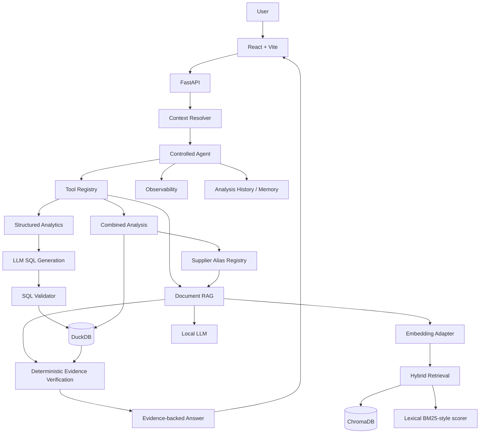

# System Architecture

## 1. Purpose

SupplyChain Copilot answers operational questions that can require both structured data and document evidence.

Representative question:

> Which open purchase orders belong to suppliers with contractual late-delivery penalties?

A reliable answer requires the system to:

1. identify that the question needs operational and contract data;
2. query open purchase orders;
3. identify suppliers in those rows;
4. resolve operational supplier names to canonical supplier names;
5. retrieve only contract evidence attributed to that supplier;
6. extract penalty terms;
7. apply deterministic qualification rules;
8. return confirmed rows and explain what was not confirmed.

## 2. High-level architecture



## 3. Repository areas

```text
backend/
├── app/
│   ├── agent/          controlled planning, execution, schemas, LLM calls
│   ├── analytics/      DuckDB, ingestion, SQL generation/validation
│   ├── context/        intent, entities, filters, time-period resolution
│   ├── ingestion/      PDF parsing, chunking, metadata, indexing
│   ├── memory/         persisted analysis history
│   ├── observability/  timing and event persistence
│   ├── rag/            embeddings, retrieval, vector store, RAG service
│   ├── reports/        report export
│   ├── routing/        routing and combined evidence logic
│   ├── tools/          controlled tool registry
│   ├── v2/             v2 API composition
│   └── main.py         FastAPI application and v1 routes
├── evals/              golden dataset, evaluators, experiments
├── scripts/            targeted engineering tests and re-index helpers
└── data/               local runtime data; generally not committed
```

## 4. Intelligence modes

### Data

Used when the question can be answered from structured operational data.

```text
question
 -> schema discovery
 -> local LLM generates one read-only DuckDB SELECT
 -> SQL validator
 -> DuckDB
 -> structured rows
 -> explanation
```

### Document

Used when the answer should come from indexed documents.

```text
question
 -> query embedding
 -> hybrid retrieval
 -> metadata filters when applicable
 -> evidence chunks
 -> local LLM
 -> answer + source pages
```

### Combined

Used when operational rows must be qualified by document evidence.

```text
open purchase orders
+ supplier identity
+ supplier contract
+ penalty clause
= confirmed POs with contractual penalties
```

This route demonstrates the central product idea: deterministic operational facts can be joined with probabilistic document extraction without allowing the LLM to become the final authority.

## 5. Controlled agent

The v2 agent is intentionally constrained.

Key properties:

- planning is model-assisted;
- tools are registered explicitly;
- tool names and arguments are validated;
- execution is bounded to a small number of rounds;
- tool errors are captured;
- final synthesis is separated from tool execution;
- analysis history and timing can be persisted.

The planner should not have unrestricted access to shell commands, arbitrary Python, or arbitrary network actions.

## 6. Structured LLM outputs

Important planning and extraction outputs are validated with Pydantic schemas.

```text
prompt
 -> model JSON
 -> JSON parsing
 -> Pydantic validation
 -> one controlled correction attempt
 -> typed application object
```

This is critical for local models because JSON reliability differs significantly across models and quantizations.

Do not remove application validation merely because a runtime provides a JSON mode.

## 7. Structured analytics

Supported structured inputs currently include CSV and XLSX, including multi-sheet workbooks.

A workbook such as:

```text
Synthetic_SupplyChain_Operations.xlsx
├── Inventory
├── Shipments
└── Purchase Orders
```

becomes separate DuckDB tables.

Natural-language flow:

```text
question
 -> schema discovery
 -> LLM SQL generation
 -> SQL validation
 -> DuckDB execution
 -> result
```

### Security / reliability rule

The model is not trusted to produce safe SQL simply because the prompt tells it to. SQL validation remains a separate application layer.

## 8. Document ingestion

```text
PDF
 -> PyMuPDF page extraction
 -> chunking
 -> metadata inference
 -> embedding
 -> ChromaDB
```

Chunk metadata can include:

- document;
- page;
- document type;
- supplier;
- contract ID when explicitly detected;
- clause type.

Metadata is not cosmetic. Supplier metadata is used as an evidence-isolation boundary.

## 9. Supplier identity resolution

Operational data can contain a shortened/trading name while the contract contains a legal name.

```text
Operational: Atlas Industrial
Contract:    Atlas Industrial Supplies Ltd.
```

The project uses an explicit alias registry:

```text
Atlas Industrial
 -> Atlas Industrial Supplies Ltd.
```

It does not silently use fuzzy matching to establish legal supplier identity.

## 10. Evidence isolation rule

For an unresolved supplier:

```text
supplier coverage = false
penalty clause = false
sources = []
```

For a resolved supplier:

```text
retrieve with metadata filter:
    supplier = canonical supplier name
```

Then extracted contract terms are validated and deterministic application logic decides whether the supplier is confirmed.

This prevents evidence leakage between suppliers.

## 11. Deterministic qualification

Conceptually:

```python
confirmed = (
    supplier_coverage_confirmed
    and penalty_clause_confirmed
)
```

The model extracts terms. Application logic decides whether the supplier or PO qualifies.

The answer should distinguish:

- confirmed suppliers;
- confirmed PO rows;
- unconfirmed suppliers;
- evidence sources;
- reasons for non-confirmation.

## 12. Hybrid retrieval

The retrieval layer supports:

- vector similarity;
- lexical BM25-style scoring;
- reciprocal-rank fusion (RRF).

```text
query
  ├─> embedding -> vector candidates
  └─> tokens -> lexical ranking

vector rank + lexical rank
  -> RRF
  -> top chunks
```

Mode selector:

```text
RAG_RETRIEVAL_MODE=vector
```

or:

```text
RAG_RETRIEVAL_MODE=hybrid
```

Hybrid retrieval reduces dependence on semantic similarity alone and helps with exact commercial terms, percentages, identifiers, clause names, and PO language.

## 13. Embeddings

The reference embedding model is Nomic Embed Text.

The current adapter prefixes inputs as:

```text
search_document: <chunk>
search_query: <question>
```

These prefixes are model-specific. If the embedding model changes, confirm whether the new model expects them.

### Critical rule

If the embedding model changes, rebuild the Chroma index unless compatibility is explicitly proven.

```text
change embedding model
 -> rebuild vectors
 -> re-index PDFs
 -> rerun retrieval evaluations
```

## 14. Observability

The v2 agent records analysis-level metrics in DuckDB.

Metrics include:

- total duration;
- planner duration;
- tool duration;
- synthesis duration;
- status;
- rounds used;
- stopped reason.

Endpoint:

```text
GET /v2/observability/summary
```

This is important when comparing local models because quality and latency can change independently.

## 15. API layers

Important existing routes include:

```text
GET  /health
GET  /dashboard

POST /upload
GET  /documents
DELETE /documents/{filename}
POST /chat

POST /data/upload
GET  /data/datasets
GET  /data/datasets/{table_name}
POST /data/query

GET  /suppliers/aliases
POST /suppliers/aliases
DELETE /suppliers/aliases/{alias_name}
GET  /suppliers/resolve/{supplier_name}

POST /ask
```

The v2 router is mounted under `/v2` and contains context, tools, agent, memory, reports, and observability APIs.

Use Swagger for the exact active schema:

```text
http://127.0.0.1:8000/docs
```

## 16. Architecture rules to preserve

1. Do not let the LLM decide legal supplier identity.
2. Do not let the LLM bypass SQL validation.
3. Do not attribute contract evidence to an unresolved supplier.
4. Do not accept model JSON without application validation.
5. Do not swap embedding models without rebuilding vectors.
6. Do not judge a new model from one demo prompt; run the golden suite.
7. Keep package `__init__.py` files import-light to avoid circular-import regressions.
8. Keep final business qualification deterministic even if the model becomes more capable.
